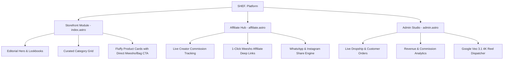

# 📜 Product Requirements Document (PRD)
## Project: SHEF. — Luxury Antigravity Fashion Reseller & Creator Affiliate Platform

---

### 1. Executive Summary & Brand Identity
**SHEF.** is a next-generation fashion resale and creator commerce engine. It merges the ultra-minimalist, high-editorial aesthetic of global luxury houses (like Zara & Jacquemus) with the high-yield affiliate and social commerce mechanics of Meesho and Wishlink.

- **Brand Tone:** Airy, tactile, understated luxury ("Antigravity").
- **Visual Identity:** Warm Stone-50 (`#FAFAF9`), Soft Stone-950 (`#0C0A09`), Muted Gold (`#B49B67`), hairline glass borders, diffused volumetric shadows.
- **Core Value Proposition:** Creators curate high-conversion Meesho/Amazon/Zara looks with instant affiliate tracking (`374453404`), while customers enjoy an editorial shopping experience with verified lowest prices.

---

### 2. Core Architecture & Modules

---

### 3. Key Functional Specifications

#### A. Main Storefront (`/`)
- **Aesthetic Hero:** Full-width editorial photography with Playfair Display typography.
- **Category Nav:** Curated categories (Women, Men, Accessories, Ethnic, Streetwear).
- **Product Cards:** Clean card layout with real Meesho price vs MRP discount badges, 3D shine hover, and dual buying actions.

#### B. Affiliate & Wishlink Hub (`/affiliate` & `/haul`)
- **Earnings Header:** Real-time earnings summary, pending payouts, and withdrawal trigger.
- **Commission Badges:** Every item highlights exact creator profit (e.g. `Earn ₹185 / sale`).
- **Creator Tooling:** 1-click link copy (`s-XXXXXX` Meesho search codes) and instant WhatsApp drop sharing.

#### C. Backoffice Admin (`/admin`)
- **KPI Metrics:** Total Revenue, Order Volume, Active Affiliates, Processed Payouts.
- **Order Fulfillment:** Live table tracking Customer Name, Phone, Address, COD/Prepaid status.
- **AI Reel Studio:** Integration shortcut to Google Veo 3.1 4K 60fps video generation and Telegram bot dispatch.

---

### 4. Technical Stack
- **Framework:** Astro 5.x (Zero-JS static HTML + islands architecture).
- **Styling:** Tailwind CSS + Custom Antigravity Design System tokens.
- **Database:** Supabase Cloud (`products`, `orders`).
- **Hosting / Edge CDN:** Cloudflare Workers & Assets.
