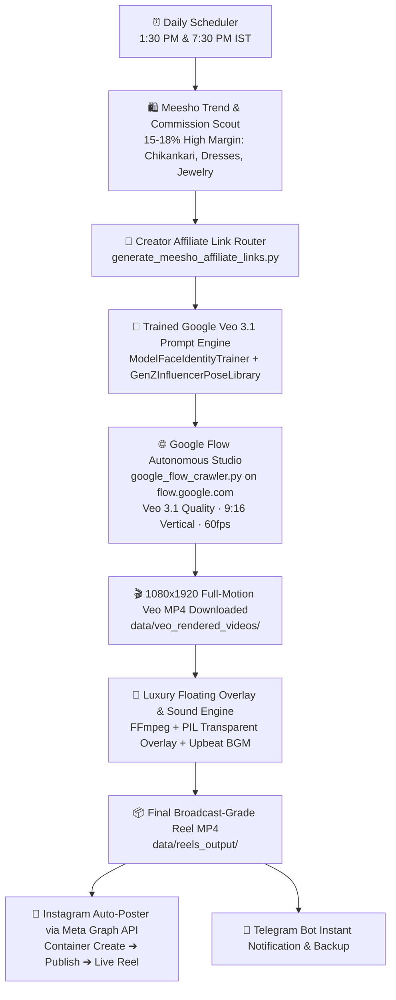

# PRD: Autonomous Instagram Reels Auto-Pilot (Google Flow / Veo 3.1 Full-Motion & Meesho Affiliate)

**Document Version:** 2.0.0 (Trained Golden Standard Lock)  
**Target Platform:** Instagram Reels + Meta Graph API  
**Integration Base:** `d:\SHELF_STORE`  
**Video Generation Standard:** 100% Full-Motion Google Flow / Google Veo 3.1 (Benchmarked against `VEO_MASTER_cinematic_4k_60fps_p_1791130399.mp4`)  
**Strict Policy:** Zero Pollinations AI / Zero 2D Static Card Fallbacks. 100% Genuine Full-Motion Generative AI.

---

## 1. Executive Summary & Golden Quality Benchmark

This pipeline automates an end-to-end content-to-commerce engine for Indian female fashion & lifestyle products:
1. **Daily Viral Product Discovery**: Automatically scans trending Meesho collections, filtering products with high rating (≥ 4.2★), high order volume, and high commission margin (15%–18%).
2. **Creator Affiliate Link Attribution**: Direct Meesho creator affiliate tracking route (`af_invite/374453404:youtube_long_form:12492338?p_id=...&utm_source=instagram_reels`).
3. **Full-Motion Video Studio (Google Flow / Veo 3.1)**:
   - **Visual Benchmark**: Matches the exact motion fidelity, camera movement, and lighting of `VEO_MASTER_cinematic_4k_60fps_p_1791130399.mp4`.
   - **Resolution & Frame Rate**: 1080x1920 (9:16 vertical), 60fps cinematic slow-motion.
   - **Persona & Identity**: 21-year-old Indian creator model with consistent facial geometry, natural golden-olive skin texture, and realistic fabric physics.
4. **Broadcast-Grade Finishing & Audio Layer**:
   - Luxury floating discount pills (`🔥 68% OFF - ₹391 ONLY`), 5-star ratings, and high-converting CTA (`👉 Comment 'LINK' for secret discount`).
   - Side-chained upbeat BGM + voiceover narration.
5. **Meta Graph API Auto-Publishing**:
   - Pushes 2 Reels daily (1:30 PM & 7:30 PM IST) directly to Instagram Reels with SEO captions, 15 viral hashtags, and Telegram preview dispatch.

---

## 2. Core Architecture & Pipeline Flow

---

## 3. Strict Quality & Anti-Degradation Rules

1. **NO POLLINATIONS / NO 2D STATIC CARD FALLBACKS**:
   - All legacy or dummy generators (Pollinations, blank card templates, static photo loops) are permanently purged and blocked.
   - Only Google Flow (`flow.google.com`) and Google Veo 3.1 generation are authorized.
2. **Consistent Model Identity & Realism**:
   - Every video utilizes the trained 21yo Indian model persona (`model_face_identity_trainer.py`).
   - No AI plastic blur: preserves soft skin pores, authentic lighting reflections, and realistic fabric weight.
3. **Deduplication Guardian**:
   - Tracks all posted URLs in `data/published_reels_history.json`.
   - Prevents the same item from being generated or posted twice within 30 days.

---

## 4. Daily Publishing Schedule

| Slot | Time (IST) | Strategy / Focus | Typical Product Selection |
| :--- | :--- | :--- | :--- |
| **Slot 1 (Afternoon)** | 1:30 PM | Casual Chic, College Trends, Day Wear | Baby pink A-line dresses, Y2K tops, Korean aesthetics |
| **Slot 2 (Evening)** | 7:30 PM | Festive Luxury, Party Glam, Evening Dupes | Chikankari Anarkali sets, silk sarees, vintage jewelry |

---

## 5. Execution Interface

- **1-Click Windows Launcher**: [`RUN_DAILY_REELS_AUTOPILOT.bat`](file:///d:/SHELF_STORE/RUN_DAILY_REELS_AUTOPILOT.bat)
- **CLI Commands**:
  - `python scripts/autopilot_daily_reels.py --slot=afternoon`
  - `python scripts/autopilot_daily_reels.py --slot=evening`
  - `python scripts/autopilot_daily_reels.py --slot=auto`
